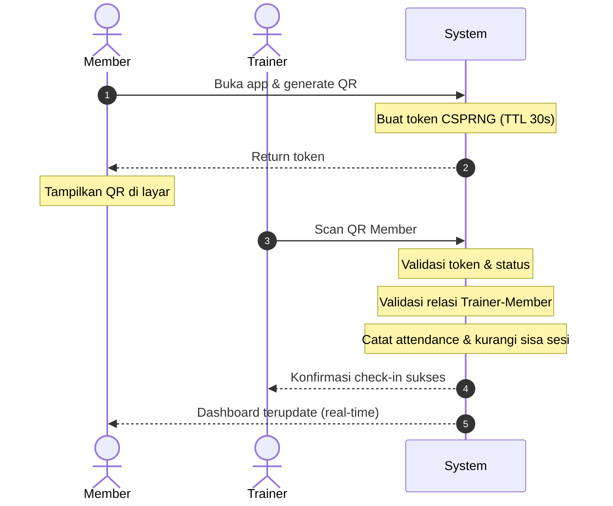
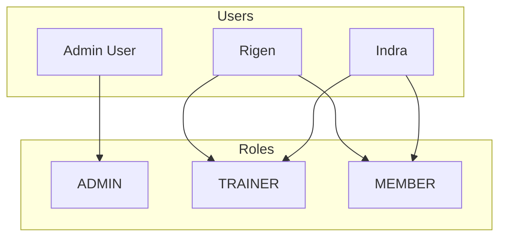
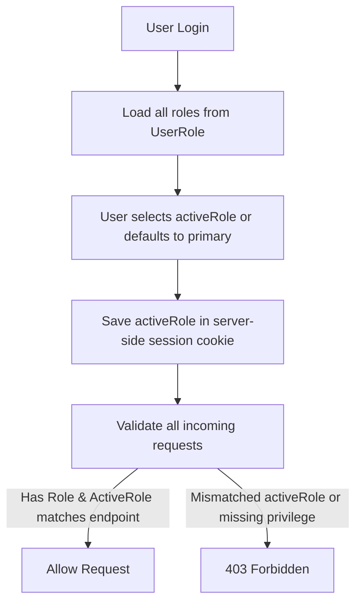
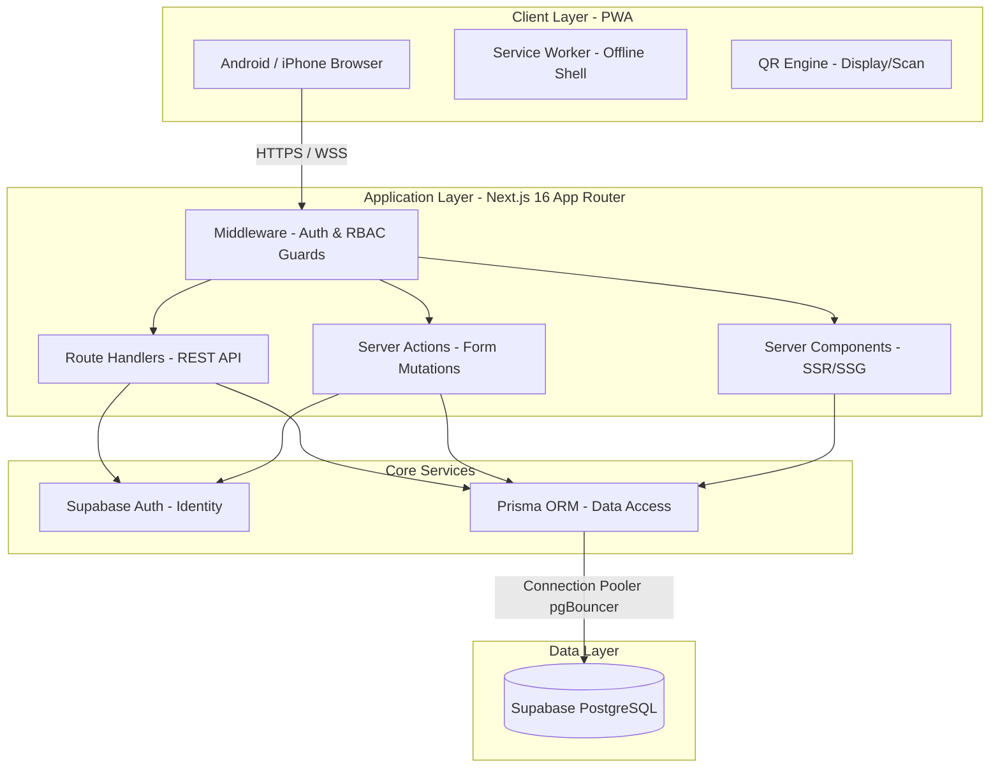
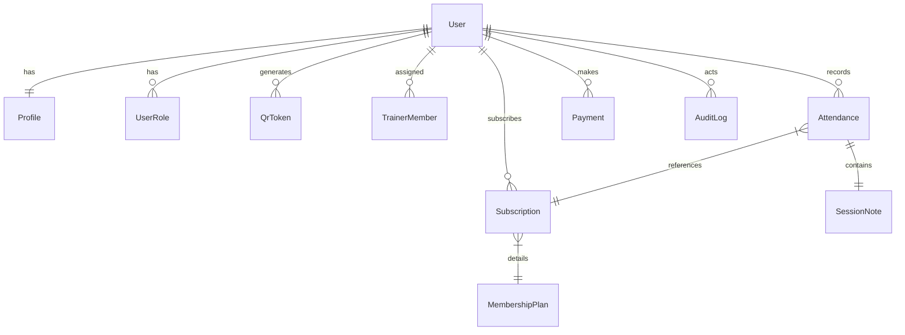
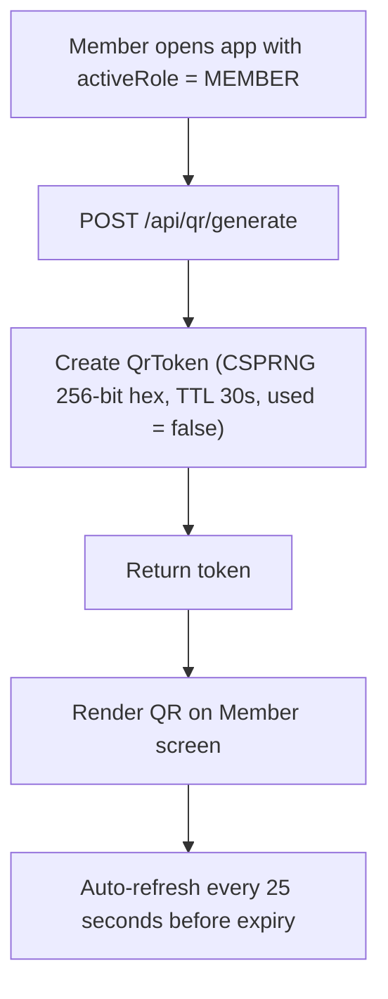
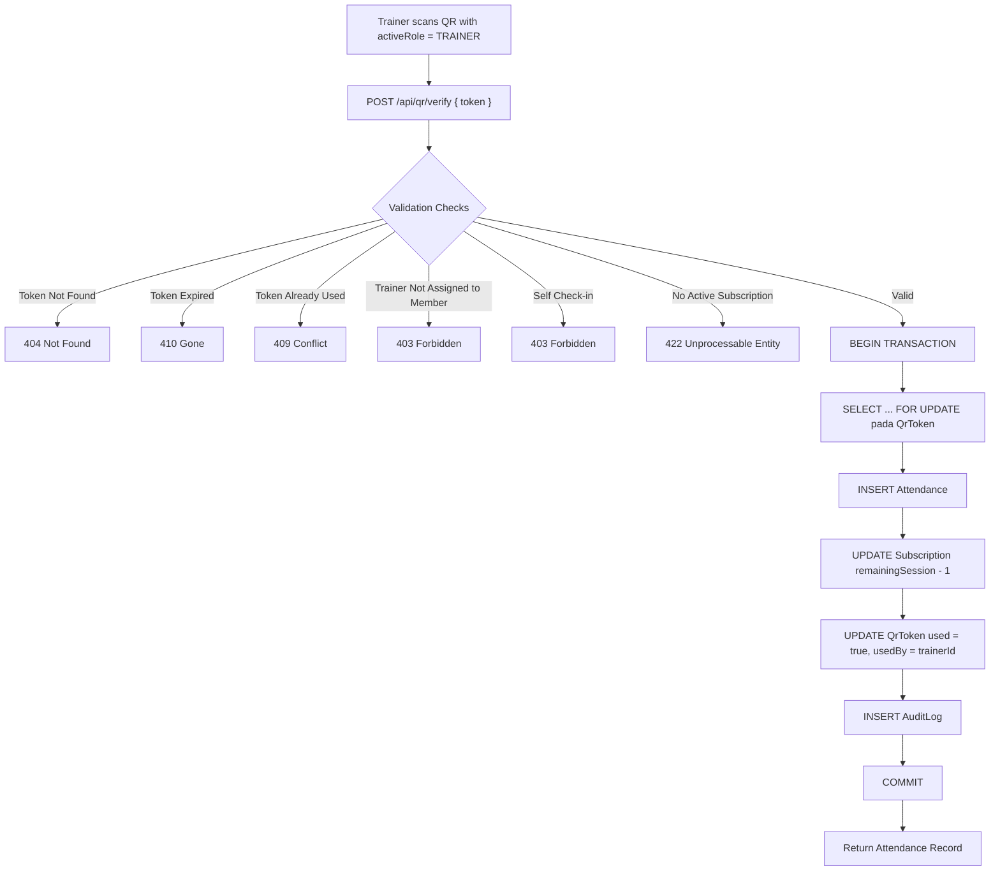

# Personal Trainer Management System (PTMS)

## System Design Document

| Field | Value |
|---|---|
| **Version** | 3.0 |
| **Status** | Draft |
| **Last Updated** | 13 July 2026 |
| **Author** | Perpahmian.ltd |
| **Platform** | Next.js 16 · Progressive Web App |
| **Database** | PostgreSQL (Supabase-managed) |
| **ORM** | Prisma 5 |
| **Auth Provider** | Supabase Auth |
| **Deployment** | Vercel (Serverless) |
| **Target Users** | Admin · Trainer · Member |

---

## Table of Contents

1. [Executive Summary](#1-executive-summary)
2. [Business Process](#2-business-process)
3. [User Types & Permissions](#3-user-types--permissions)
4. [Multi-Role System](#4-multi-role-system)
5. [High-Level Architecture](#5-high-level-architecture)
   - 5.1 [Layer Responsibilities](#51-layer-responsibilities)
   - 5.2 [Connection Pooling](#52-connection-pooling-wajib-untuk-serverless)
6. [Technology Stack](#6-technology-stack)
7. [Core Modules](#7-core-modules)
8. [Database Design](#8-database-design)
9. [Attendance Flow](#9-attendance-flow)
10. [API Design](#10-api-design)
11. [Security Architecture](#11-security-architecture)
12. [PWA Requirements](#12-pwa-requirements)
13. [Dashboard Metrics](#13-dashboard-metrics)
14. [Development Roadmap](#14-development-roadmap)
15. [Future Roadmap](#15-future-roadmap)
16. [Security & Operational Policies](#16-security--operational-policies)

---

## 1. Executive Summary

**Personal Trainer Management System (PTMS)** adalah aplikasi berbasis Progressive Web App (PWA) yang membantu trainer dan member mengelola operasional personal training secara terpusat.

### Scope

| Domain | Capability |
|---|---|
| Attendance | Check-in via dynamic QR Code |
| Membership | Package & subscription management |
| Session | Tracking & session notes |
| Finance | Payment & revenue tracking |
| Relationship | Trainer ↔ Member assignment |
| History | Personal training records |

### Kenapa PWA?

| Benefit | Detail |
|---|---|
| Cross-platform | Installable di Android & iPhone via browser |
| Distribution | Tidak perlu publish ke Play Store / App Store |
| Cost | Biaya maintenance lebih rendah dibanding native app |
| Update | Deploy langsung tanpa review store |

---

## 2. Business Process

### 2.1 Current State (Manual)

| Pain Point | Impact |
|---|---|
| Absensi manual (catatan) | Data tidak terstruktur, sulit diaudit |
| Pembayaran via WhatsApp | Tidak ada single source of truth |
| Progress dicatat manual | Sulit dilacak historis |
| Sisa sesi tidak real-time | Risiko dispute dengan member |
| Revenue tidak terpusat | Sulit analisis bisnis |

### 2.2 Proposed Flow



---

## 3. User Types & Permissions

### 3.1 Role Matrix

| Capability | Admin | Trainer | Member |
|---|:---:|:---:|:---:|
| Kelola user / trainer / member | ✅ | ❌ | ❌ |
| Kelola paket & pembayaran | ✅ | ❌ | ❌ (read own) |
| Dashboard & laporan global | ✅ | ❌ | ❌ |
| Scan QR & catat attendance | ✅ | ✅ | ❌ |
| Lihat member yang di-assign | ✅ | ✅ | ❌ |
| Tulis session notes | ✅ | ✅ | ❌ |
| Tampilkan QR check-in | ❌ | ❌ | ✅ |
| Lihat attendance & progress sendiri | ✅ | ❌ | ✅ |
| Lihat revenue pribadi | ✅ | ✅ (opsional) | ❌ |

### 3.2 Role Descriptions

**Admin** - Hak akses penuh terhadap seluruh modul: user management, paket, pembayaran, dashboard, dan laporan.

**Trainer** - Operasional harian: scan QR member yang di-assign, lihat attendance, tulis session notes, dan (opsional) lihat revenue pribadi.

**Member** - Self-service: tampilkan QR, lihat attendance history, trainer aktif, paket aktif, pembayaran, dan progress.

---

## 4. Multi-Role System

### 4.1 Requirement

Satu akun dapat memiliki **multiple roles secara bersamaan**.



### 4.2 Design Decision

| Decision | Rationale |
|---|---|
| Role **tidak** disimpan di tabel `User` | Mendukung multi-role tanpa kolom boolean yang rigid |
| Role disimpan di tabel `UserRole` | Normalized, extensible, dengan unique constraint per user-role pair |
| Active role disimpan di **session context** | UI dan authorization berjalan berdasarkan role yang sedang aktif |

### 4.3 Role Switching Flow



### 4.4 Multi-Role Rules (Wajib Diimplementasi)

| Rule | Enforcement |
|---|---|
| Endpoint trainer hanya bisa diakses jika `activeRole = TRAINER` | Middleware / server guard |
| Endpoint member hanya bisa diakses jika `activeRole = MEMBER` | Middleware / server guard |
| User dengan role TRAINER + MEMBER tidak boleh self-check-in | Block jika `trainerId === memberId` pada scan |
| Penambahan role ADMIN hanya oleh ADMIN | Server-side validation |
| `trainerId` harus user yang punya role TRAINER | FK + application guard |
| `memberId` harus user yang punya role MEMBER | FK + application guard |

---

## 5. High-Level Architecture



### 5.1 Layer Responsibilities

| Layer | Responsibility |
|---|---|
| Client (PWA) | UI, QR generate/display, QR scan, offline shell |
| Middleware | Session validation, role check, rate limit entry |
| Server Actions | Form mutations dengan type-safe contracts |
| Route Handlers | REST API untuk operasi kompleks / third-party |
| Prisma | Database access, transactions, type generation |
| Supabase Auth | Identity, password hashing, session, email verification |

### 5.2 Connection Pooling (Wajib untuk Serverless)

> Vercel = serverless functions. Setiap invocation berpotensi membuka koneksi baru ke PostgreSQL. Supabase free/pro tier memiliki limit **60 concurrent connections**.

| Strategy | Implementation |
|---|---|
| Supabase Pooler | Gunakan connection string port `6543` (pgBouncer), bukan `5432` |
| Prisma datasource | Set `?pgbouncer=true&connection_limit=5` di DATABASE_URL |
| Alternative | Prisma Accelerate (managed connection pool) |

```text
# ❌ Direct connection (akan habiskan pool)
DATABASE_URL="postgresql://...@db.xxx.supabase.co:5432/postgres"

# ✅ Pooled connection (wajib untuk Vercel)
DATABASE_URL="postgresql://...@db.xxx.supabase.co:6543/postgres?pgbouncer=true&connection_limit=5"
```

---

## 6. Technology Stack

### 6.1 Stack Overview

| Layer | Technology | Purpose |
|---|---|---|
| Framework | Next.js 16, React 19, TypeScript | Full-stack app |
| Styling | Tailwind CSS, Shadcn UI | UI components |
| Backend | Server Actions, Route Handlers | API & mutations |
| Database | PostgreSQL (Supabase) | Persistent storage |
| ORM | Prisma | Type-safe DB access |
| Auth | Supabase Auth | Identity management |
| Validation | Zod, React Hook Form | Input validation |
| State | Zustand (UI), TanStack Query (server) | Client state |
| QR | html5-qrcode | Camera-based scanning |
| Deploy | Vercel | Hosting & CI/CD |

### 6.2 Stack Decision Notes

| Topic | Decision |
|---|---|
| Supabase Auth + Prisma | Auth di Supabase; data di PostgreSQL via Prisma. Perlu sync `auth.users.id` ↔ `User.id` |
| Server Actions vs Route Handlers | Server Actions untuk form/UI mutations; Route Handlers untuk API yang butuh REST semantics |
| TanStack Query vs Zustand | TanStack Query untuk server state (cache, refetch); Zustand hanya untuk UI state (active role, modal) |

---

## 7. Core Modules

| Module | Features |
|---|---|
| **Authentication** | Register, login, logout, forgot password |
| **User Management** | Profile, avatar, contact information |
| **Role Management** | Add role, switch active role |
| **Trainer-Member** | Assign, remove, view relationship |
| **Attendance** | Generate QR, scan QR, history |
| **Membership** | Package management, subscription management |
| **Finance** | Payment recording, revenue, outstanding |
| **Reporting** | Monthly, attendance, revenue reports |

---

## 8. Database Design

### 8.1 Entity Relationship Overview



### 8.2 Prisma Schema

#### Enums

```prisma
enum Role {
  ADMIN
  TRAINER
  MEMBER
}

enum Gender {
  MALE
  FEMALE
  OTHER
}

enum SubscriptionStatus {
  ACTIVE
  EXPIRED
  CANCELLED
  SUSPENDED
}

enum PaymentMethod {
  CASH
  TRANSFER
  QRIS
  OTHER
}
```

#### User

```prisma
model User {
  id        String    @id // Sync dengan Supabase auth.users.id
  email     String    @unique
  createdAt DateTime  @default(now())
  updatedAt DateTime  @updatedAt
  deletedAt DateTime?

  profile Profile?
  roles   UserRole[]

  trainerRelations TrainerMember[] @relation("TrainerRelations")
  memberRelations  TrainerMember[] @relation("MemberRelations")
  subscriptions    Subscription[]
  attendances      Attendance[]    @relation("MemberAttendances")
  trainedSessions  Attendance[]    @relation("TrainerAttendances")
  payments         Payment[]
  qrTokens         QrToken[]
  auditLogs        AuditLog[]
}
```

#### Profile

```prisma
model Profile {
  id        String    @id @default(cuid())
  userId    String    @unique
  fullName  String
  phone     String?
  gender    Gender?
  birthDate DateTime?
  avatarUrl String?
  address   String?

  user User @relation(fields: [userId], references: [id], onDelete: Cascade)
}
```

#### UserRole

```prisma
model UserRole {
  id        String   @id @default(cuid())
  userId    String
  role      Role
  createdAt DateTime @default(now())

  user User @relation(fields: [userId], references: [id], onDelete: Cascade)

  @@unique([userId, role])
  @@index([userId])
}
```

#### TrainerMember

```prisma
model TrainerMember {
  id        String    @id @default(cuid())
  trainerId String
  memberId  String
  isActive  Boolean   @default(true)
  startDate DateTime  @default(now())
  endDate   DateTime?
  createdAt DateTime  @default(now())
  deletedAt DateTime? // soft delete support

  trainer User @relation("TrainerRelations", fields: [trainerId], references: [id])
  member  User @relation("MemberRelations", fields: [memberId], references: [id])

  @@unique([trainerId, memberId])
  @@index([trainerId])
  @@index([memberId])
}
```

#### MembershipPlan

```prisma
model MembershipPlan {
  id           String    @id @default(cuid())
  name         String
  totalSession Int?      // null = unlimited
  price        Decimal   @db.Decimal(12, 2)
  description  String?
  isActive     Boolean   @default(true)
  createdAt    DateTime  @default(now())
  deletedAt    DateTime? // soft delete support

  subscriptions Subscription[]
}
```

#### Subscription

```prisma
model Subscription {
  id               String             @id @default(cuid())
  memberId         String
  planId           String
  startDate        DateTime
  endDate          DateTime?
  remainingSession Int
  status           SubscriptionStatus @default(ACTIVE)
  createdAt        DateTime           @default(now())
  updatedAt        DateTime           @updatedAt
  deletedAt        DateTime?          // soft delete support

  member     User           @relation(fields: [memberId], references: [id])
  plan       MembershipPlan @relation(fields: [planId], references: [id])
  attendances Attendance[]
  payments   Payment[]

  @@index([memberId, status])
}
```

#### Attendance

```prisma
model Attendance {
  id             String   @id @default(cuid())
  memberId       String
  trainerId      String
  subscriptionId String
  checkedInAt    DateTime @default(now())
  createdAt      DateTime @default(now())

  member       User         @relation("MemberAttendances", fields: [memberId], references: [id])
  trainer      User         @relation("TrainerAttendances", fields: [trainerId], references: [id])
  subscription Subscription @relation(fields: [subscriptionId], references: [id])
  sessionNote  SessionNote?

  @@index([memberId, checkedInAt])
  @@index([trainerId, checkedInAt])
}
```

#### SessionNote

```prisma
model SessionNote {
  id           String   @id @default(cuid())
  attendanceId String   @unique
  note         String
  createdAt    DateTime @default(now())

  attendance Attendance @relation(fields: [attendanceId], references: [id], onDelete: Cascade)
}
```

#### Payment

```prisma
model Payment {
  id             String        @id @default(cuid())
  memberId       String
  subscriptionId String?
  amount         Decimal       @db.Decimal(12, 2)
  paidAt         DateTime
  method         PaymentMethod
  note           String?
  createdAt      DateTime      @default(now())

  member       User          @relation(fields: [memberId], references: [id])
  subscription Subscription? @relation(fields: [subscriptionId], references: [id])

  @@index([memberId])
}
```

#### QrToken

```prisma
model QrToken {
  id        String   @id @default(cuid())
  userId    String
  token     String   @unique
  expiredAt DateTime
  used      Boolean  @default(false)
  usedAt    DateTime?
  usedBy    String?  // trainerId yang melakukan scan
  createdAt DateTime @default(now())

  user User @relation(fields: [userId], references: [id], onDelete: Cascade)

  @@index([token, expiredAt])
  @@index([userId, createdAt])
}
```

#### AuditLog

```prisma
model AuditLog {
  id         String   @id @default(cuid())
  actorId    String
  action     String
  entityType String
  entityId   String?
  metadata   Json?
  createdAt  DateTime @default(now())

  actor User @relation(fields: [actorId], references: [id])

  @@index([actorId])
  @@index([entityType, entityId])
  @@index([createdAt])
}
```

### 8.3 Critical Database Constraints

| Constraint | Purpose |
|---|---|
| `@@unique([userId, role])` | Mencegah duplikasi role |
| `@@unique([trainerId, memberId])` | Mencegah duplikasi assignment |
| FK ke `User` di semua entitas | Integritas referensial |
| `subscriptionId` di `Attendance` | Audit trail sisa sesi yang dikurangi |
| Transaction atomic pada check-in | Attendance + decrement session + mark token used harus satu transaksi |

---

## 9. Attendance Flow

### 9.1 Generate QR (Member)



### 9.2 Scan QR (Trainer)



### 9.3 Session Reduction Rules

| Kondisi | Behavior / Business Rule |
|---|---|
| `remainingSession > 0` | Decrement 1, status tetap ACTIVE |
| `remainingSession = 1` → 0 | Decrement, set status EXPIRED |
| `totalSession = null` (unlimited) | Tidak decrement, hanya catat attendance |
| Multiple ACTIVE subscriptions | Dikurangi dari subscription dengan `endDate` terdekat (earliest expiry first) |
| Double Scan Prevention | Maksimal 1 check-in per 4 jam untuk member-trainer pair yang sama (dapat di-bypass oleh Admin) |

---

## 10. API Design

### 10.1 Conventions

| Convention | Standard |
|---|---|
| Auth | httpOnly session cookie via Supabase Auth |
| Role context | **Server-side session only** - `activeRole` dibaca dari session store / signed JWT claim, **bukan** dari client header |
| Pagination | `?page=1&limit=20` |
| Error format | `{ "error": { "code": "...", "message": "..." } }` |
| Success format | `{ "data": ... }` |
| Timestamps | Semua dalam UTC. Client convert ke timezone lokal (WIB) untuk display |

> **⚠️ PENTING:** Jangan pernah membaca `activeRole` dari HTTP header (misal `X-Active-Role`). Header dikontrol client - siapapun bisa mengirim `X-Active-Role: ADMIN` via curl dan mendapat akses penuh. Role context **harus** dari server-side session yang di-sign oleh server.

### 10.2 Endpoints

#### Auth

| Method | Endpoint | Role | Description |
|---|---|---|---|
| POST | `/api/auth/register` | Public | Register user baru |
| POST | `/api/auth/login` | Public | Login |
| POST | `/api/auth/logout` | Auth | Logout |

#### User

| Method | Endpoint | Role | Description |
|---|---|---|---|
| GET | `/api/users/me` | Auth | Profil user + roles |
| PATCH | `/api/users/me` | Auth | Update profil |

#### Role

| Method | Endpoint | Role | Description |
|---|---|---|---|
| GET | `/api/roles` | Auth | List roles user |
| POST | `/api/roles/switch` | Auth | Switch active role |
| POST | `/api/roles` | Admin | Assign role ke user |
| DELETE | `/api/roles/:id` | Admin | Hapus role user |

#### Trainer-Member

| Method | Endpoint | Role | Description |
|---|---|---|---|
| GET | `/api/trainer-members` | Admin, Trainer | List relasi |
| POST | `/api/trainer-members` | Admin | Assign member ke trainer |
| DELETE | `/api/trainer-members/:id` | Admin | Hapus relasi |

#### Attendance

| Method | Endpoint | Role | Description |
|---|---|---|---|
| POST | `/api/attendance/checkin` | Trainer | Scan & check-in (via QR verify) |
| GET | `/api/attendance/history` | All | History (scoped by role) |

#### QR

| Method | Endpoint | Role | Description |
|---|---|---|---|
| POST | `/api/qr/generate` | Member | Generate dynamic token |
| POST | `/api/qr/verify` | Trainer | Verify & process check-in |

#### Payment

| Method | Endpoint | Role | Description |
|---|---|---|---|
| POST | `/api/payments` | Admin | Catat pembayaran |
| GET | `/api/payments` | Admin, Member | List pembayaran (scoped) |

#### Membership

| Method | Endpoint | Role | Description |
|---|---|---|---|
| GET | `/api/plans` | Admin | List paket |
| POST | `/api/plans` | Admin | Buat paket |
| GET | `/api/subscriptions` | Admin, Member | List subscription |
| POST | `/api/subscriptions` | Admin | Buat subscription |

---

## 11. Security Architecture

### 11.1 Authentication

| Aspect | Implementation |
|---|---|
| Provider | Supabase Auth |
| Password | Hashed by Supabase (bcrypt), tidak disimpan di app |
| Session | JWT + refresh token, managed by Supabase |
| Email | Verification on register (recommended) |

### 11.2 Authorization (RBAC)

```text
ADMIN
  └─ Full access semua resource

TRAINER (activeRole = TRAINER)
  └─ Hanya member yang di-assign via TrainerMember
  └─ Hanya attendance & notes yang dibuat sendiri

MEMBER (activeRole = MEMBER)
  └─ Hanya data milik sendiri (profile, subscription, payment, attendance)
```

**Enforcement layers:**

1. **Middleware** - Validasi session + active role
2. **Server Action / Route Handler** - Resource-level authorization
3. **Database transaction** - Row-level check sebelum mutation

### 11.3 Dynamic QR Security

| Threat | Mitigation |
|---|---|
| Static QR forgery | QR hanya berisi `{ "token": "uuid" }`, bukan memberId |
| Replay attack | Single-use token (`used = true`) |
| Token theft (30s window) | Short TTL (30 detik), auto-regenerate |
| Race condition (double scan) | `SELECT FOR UPDATE` dalam transaction |
| Unauthorized trainer | Validasi TrainerMember relationship |
| Self check-in | Block `trainerId === memberId` |

### 11.4 Additional Security Measures

| Measure | Scope |
|---|---|
| HTTPS only | Semua komunikasi |
| Rate limiting | `/api/auth/login`, `/api/qr/generate`, `/api/qr/verify` - 5–10 req/min per IP/user |
| Audit logging | LOGIN, LOGOUT, PAYMENT_CREATED, ATTENDANCE_CREATED, USER_UPDATED, ROLE_ADDED |
| Soft delete | User, MembershipPlan - preserve audit trail |
| Input validation | Zod schema di setiap endpoint |
| CSRF protection | Built-in Next.js Server Actions origin check |
| Idempotency | Unique constraint + transaction pada attendance creation |

### 11.5 Rate Limiting Matrix

| Endpoint | Limit | Key |
|---|---|---|
| `POST /api/auth/login` | 5/min | IP |
| `POST /api/qr/generate` | 10/min | userId |
| `POST /api/qr/verify` | 10/min | userId |
| `POST /api/attendance/checkin` | 10/min | userId |
| `POST /api/auth/register` | 3/min | IP |

---

## 12. PWA Requirements

### 12.1 MVP Features

| Feature | Priority |
|---|---|
| Installable (manifest.json) | P0 |
| Responsive layout | P0 |
| App icon & splash screen | P0 |
| Offline shell (cached layout) | P1 |
| Service worker | P1 |

### 12.2 Future Features

| Feature | Notes |
|---|---|
| Push notification | Session reminder, payment due |
| Background sync | **Hati-hati**: bertentangan dengan dynamic QR security |
| Offline attendance queue | Perlu redesign token model jika diimplementasi |

---

## 13. Dashboard Metrics

### Admin

| Metric | Source |
|---|---|
| Total member | `UserRole WHERE role = MEMBER` |
| Total trainer | `UserRole WHERE role = TRAINER` |
| Total revenue | `SUM(Payment.amount)` |
| Active subscriptions | `Subscription WHERE status = ACTIVE` |
| Attendance today | `Attendance WHERE checkedInAt = today` |

### Trainer

| Metric | Source |
|---|---|
| Total assigned member | `TrainerMember WHERE trainerId = me AND isActive` |
| Attendance today | `Attendance WHERE trainerId = me AND today` |
| Attendance this month | `Attendance WHERE trainerId = me AND this month` |

### Member

| Metric | Source |
|---|---|
| Remaining session | `Subscription.remainingSession WHERE status = ACTIVE` |
| Attendance history | `Attendance WHERE memberId = me` |
| Active trainer | `TrainerMember WHERE memberId = me AND isActive` |
| Active package | `Subscription JOIN MembershipPlan WHERE status = ACTIVE` |

---

## 14. Development Roadmap

| Phase | Scope | Estimate | Dependency |
|---|---|---|---|
| **1 - Foundation & Security** | Auth, User, Role, Audit Log setup, Supabase sync | 4 days | - |
| **2 - Trainer-Member** | Assignment module | 2 days | Phase 1 |
| **3 - Attendance & CSPRNG QR** | Dynamic QR (CSPRNG), scan check-in, atomic transactions | 5 days | Phase 2 |
| **4 - Membership** | Plans, subscriptions | 3 days | Phase 1 |
| **5 - Payment** | Payment recording, outstanding tracking | 3 days | Phase 4 |
| **6 - Dashboard & Metrics** | Role-based metrics, analytics query optimization | 3 days | Phase 3, 5 |
| **7 - Security Hardening** | Rate limits, session revocation UI, CORS/CSP | 2 days | Phase 3 |
| **8 - PWA Shell** | Manifest, service worker, performance optimization | 2 days | Phase 6 |

**Total MVP Duration: 24 Working Days**

---

## 15. Future Roadmap

| Version | Features |
|---|---|
| **V2** | Trainer commissions, automated payment & session WhatsApp/Push reminders |
| **V3** | Payment gateway integration (Midtrans / Xendit) |
| **V4** | Progress & body measurement tracking metrics |
| **V5** | Standalone Native Android & iOS applications |
| **V6** | AI analytics, attendance forecasting, churn prediction models |

---

## 16. Security & Operational Policies

### 16.1 Access Control & Authentication
* **Role Verification:** Client-side role assertions (such as headers or unsecured cookie fields) are completely forbidden. The active user role context (`activeRole`) must be resolved exclusively on the server side using cryptographically signed claims or server-cached sessions.
* **Role Switching Guard:** When switching roles, authorization states must be invalidated globally. Short-lived access tokens combined with server-side active role checking must block users from accessing cross-role endpoints.
* **Administrative Privileges:** Admin role assignments are restricted to database migrations or existing Administrator updates logged directly to `AuditLog`.

### 16.2 Infrastructure & Database Security
* **Connection Pooling:** In serverless environments (Vercel), connections to PostgreSQL must go through Supabase's transaction pooler (pgBouncer) on port `6543`. Direct connection (port `5432`) is prohibited in the runtime configuration to prevent pool exhaustion.
* **Row Level Security (RLS):** Application layer queries bypass RLS by design using the database client. Thus, authorization validation (checking relations and ownership) must be strictly implemented in Next.js Server Actions and API Route Handlers.

### 16.3 Check-in Integrity
* **Cryptographic Tokens:** Check-in QR codes must employ tokens generated using a cryptographically secure pseudo-random number generator (CSPRNG) with at least 256-bit entropy. Static identifiers are not permitted.
* **Atomic Deduplication:** Scan verification must wrap QR token invalidation, attendance creation, and session decrement in a single database transaction using `SELECT FOR UPDATE` to completely eliminate race conditions and double check-ins.

### 16.4 Data Consistency & Timezones
* **Database Timezone:** All timestamps stored in the database must use the UTC timezone.
* **Operational Timezones:** Query date boundaries (e.g., "today's attendance limits") must convert UTC timestamps to Western Indonesian Time (WIB, UTC+7) at the application server level before evaluating check-in limits.
* **Data Pruning:** Generative transactional tables (`QrToken`) must be pruned weekly via an automated database cron script.

---

*End of Document - Version 3.0*
